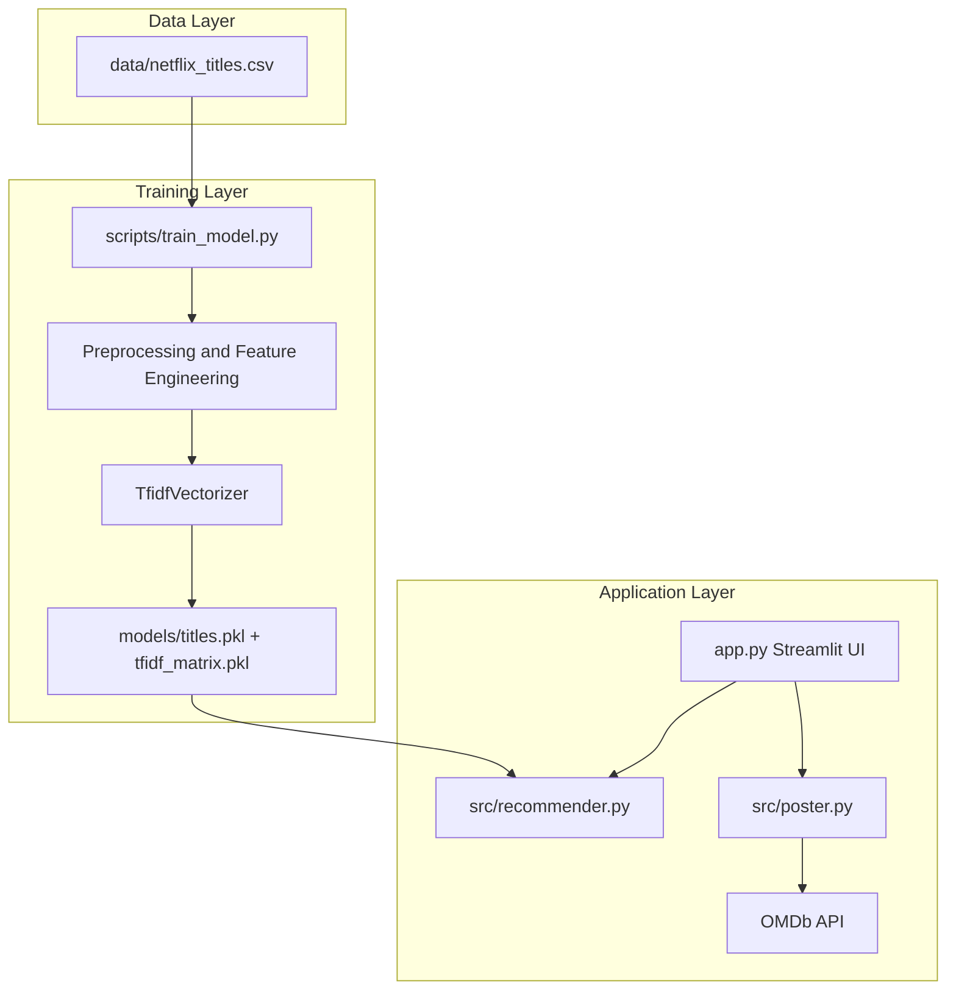
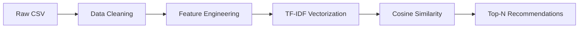

# Netflix Recommendation System

[](https://www.python.org/)
[](https://streamlit.io/)
[](https://scikit-learn.org/)
[](LICENSE)

A content-based movie and TV show recommendation engine built with TF-IDF vectorization and cosine similarity. Enter a Netflix title you enjoy and discover similar content based on descriptions, cast, and directors.

**Repository:** [github.com/anushkamishra7355/netflix-recommendation-system](https://github.com/anushkamishra7355/netflix-recommendation-system)

---

## Overview

This project implements a **content-based filtering** recommender system for Netflix titles. Unlike collaborative filtering, it does not require user ratings—recommendations are generated purely from item metadata and text features.

The system is deployed as an interactive **Streamlit** web application with optional movie poster integration via the OMDb API.

---

## Problem Statement

With thousands of titles on streaming platforms, users face choice overload. This project addresses the discovery problem by recommending titles semantically similar to a user's selection, using natural language features extracted from Netflix metadata.

---

## Features

- Content-based recommendations using TF-IDF + cosine similarity
- 8,800+ Netflix movies and TV shows
- Interactive Streamlit web UI with loading indicators
- Similarity scores displayed for each recommendation
- Optional movie poster fetching (OMDb API)
- Reproducible artifact build pipeline
- Offline evaluation with precision@K, recall@K, F1@K, and hit rate@K
- Cloud-ready deployment configs (Streamlit Cloud, Render, Railway)

---

## Dataset

| Property | Value |
|----------|-------|
| Source | [Netflix Shows Dataset (Kaggle)](https://www.kaggle.com/datasets/shivamb/netflix-shows) |
| Location | `data/netflix_titles.csv` |
| Size | 8,807 titles |
| Features | title, description, cast, director, genre, country, release year, and more |

---

## Project Architecture



---

## Machine Learning Pipeline



1. **Data Cleaning** — Impute missing countries; fill null text fields
2. **Feature Engineering** — Concatenate description, cast, and director into `combined`
3. **TF-IDF** — Convert text to sparse numerical vectors (unigrams + bigrams + trigrams)
4. **Similarity** — Compute cosine similarity between query title and all titles
5. **Ranking** — Return top-N most similar titles

See [docs/ML_DOCUMENTATION.md](docs/ML_DOCUMENTATION.md) for detailed ML documentation.

---

## Technologies Used

| Category | Tools |
|----------|-------|
| Language | Python 3.11+ |
| ML | scikit-learn, scipy, numpy, pandas |
| UI | Streamlit |
| API | requests (OMDb) |
| Deployment | Streamlit Cloud, Render, Railway |

---

## Installation

### Prerequisites

- Python 3.11 or higher
- pip

### Setup

```bash
git clone https://github.com/anushkamishra7355/netflix-recommendation-system.git
cd netflix-recommendation-system

python -m venv .venv
source .venv/bin/activate

pip install -r requirements.txt
python scripts/train_model.py
```

### Optional: OMDb API Key

```bash
export OMDB_API_KEY="your_api_key_here"
```

Get a free key at [omdbapi.com](https://www.omdbapi.com/apikey.aspx).

---

## Usage

### Run locally

```bash
streamlit run app.py
```

Open [http://localhost:8501](http://localhost:8501) in your browser.

1. Select a title from the dropdown
2. Click **Recommend**
3. View similar titles with similarity scores and posters

### Rebuild model artifacts

```bash
python scripts/train_model.py
```

### Run offline evaluation

```bash
python scripts/evaluate_model.py
```

Results are written to [docs/evaluation_results.md](docs/evaluation_results.md).

---

## Screenshots

| Home | Recommendations |
|------|-----------------|
| Placeholder | Placeholder |

Add screenshots after running the app locally or deploying.

---

## Results

Example recommendations for **Kota Factory**:

| Rank | Title | Similarity |
|------|-------|------------|
| 1 | Chaman Bahaar | 0.196 |
| 2 | Yeh Meri Family | 0.158 |
| 3 | Betaal | 0.127 |
| 4 | Super Nani | 0.120 |
| 5 | Paharganj | 0.107 |

Recommendations surface Indian TV shows with similar themes (education, family, drama).

### Offline evaluation (@K = 10)

| Metric | Score |
|--------|------:|
| Precision@K | 0.5169 |
| Recall@K | 0.0039 |
| F1@K | 0.0076 |
| Hit Rate@K | 0.9633 |

Evaluation uses genre overlap (`listed_in`) as a relevance proxy because the dataset has no user ratings. See [docs/evaluation_results.md](docs/evaluation_results.md) for methodology.

---

## Future Improvements

- Sentence-BERT embeddings for semantic similarity
- Hybrid content + collaborative filtering
- Unit and integration tests with pytest
- CI/CD with GitHub Actions
- Recommendation explanations (shared keywords)
- Docker containerization

---

## Project Structure

```
netflix-recommendation-system/
├── LICENSE
├── app.py                      # Primary Streamlit entry point
├── requirements.txt
├── Procfile
├── render.yaml
├── railway.json
├── setup.sh
├── data/
│   └── netflix_titles.csv
├── models/
│   ├── titles.pkl              # Required at runtime
│   ├── tfidf_matrix.pkl        # Required at runtime
│   └── vectorizer.pkl          # Saved during training; not loaded at inference
├── src/
│   ├── config.py
│   ├── recommender.py
│   ├── poster.py
│   └── evaluation.py
├── scripts/
│   ├── train_model.py
│   └── evaluate_model.py
├── notebooks/
│   └── netflix-recommendation-system.ipynb
├── docs/
│   ├── ML_DOCUMENTATION.md
│   ├── AMAZON_MLSS.md
│   ├── RECRUITER_REVIEW.md
│   ├── evaluation_results.md
│   └── evaluation_metrics.json
└── .streamlit/
    ├── config.toml
    └── secrets.toml.example
```

---

## Deployment

Model artifacts (`models/titles.pkl` and `models/tfidf_matrix.pkl`) are required before the app can serve recommendations.

| Platform | Artifact build | Entry point |
|----------|----------------|-------------|
| **Streamlit Cloud** | Commit `models/*.pkl` to the repo, or run `python scripts/train_model.py` locally and push | `app.py` |
| **Render** | Automatic via `render.yaml` build command | `app.py` |
| **Railway** | Automatic via `railway.json` build command | `app.py` |
| **Heroku / Procfile** | Automatic via `setup.sh` if artifacts are missing | `app.py` |

### Streamlit Cloud

1. Push the repository to GitHub
2. Run `python scripts/train_model.py` locally and commit the generated `models/` artifacts, **or** ensure they are already in the repo
3. Go to [share.streamlit.io](https://share.streamlit.io)
4. Connect the repository and set the main file to `app.py`
5. Add `OMDB_API_KEY` in Secrets (optional)
6. Deploy

> Streamlit Cloud installs dependencies from `requirements.txt` but does not run a custom training step. The app needs pre-built artifacts in `models/`.

### Render

Uses `render.yaml` automatically:

- **Build:** `pip install -r requirements.txt && python scripts/train_model.py`
- **Start:** `streamlit run app.py --server.port=$PORT --server.address=0.0.0.0`

Set `OMDB_API_KEY` in the Render dashboard (optional).

### Railway

```bash
railway login
railway init
railway up
```

`railway.json` runs the same training build step as Render. Set `OMDB_API_KEY` via Railway variables (optional).

### Heroku (Procfile)

The Procfile runs `setup.sh`, which creates Streamlit server config and calls `python scripts/train_model.py` when `models/titles.pkl` is missing.

---

## Documentation

- [ML Documentation](docs/ML_DOCUMENTATION.md)
- [Amazon MLSS Documentation](docs/AMAZON_MLSS.md)
- [Recruiter Review](docs/RECRUITER_REVIEW.md)
- [Evaluation Results](docs/evaluation_results.md)

---

## Author

**Anushka Mishra**

---

## License

This project is licensed under the MIT License. See [LICENSE](LICENSE) for details.
